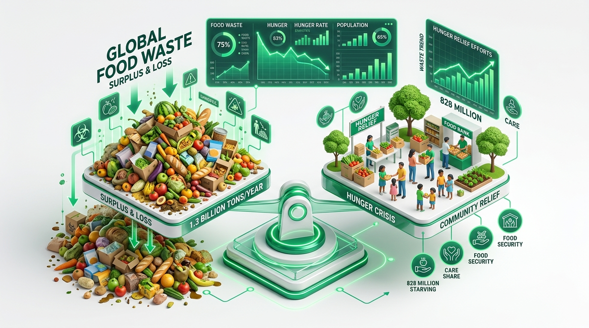
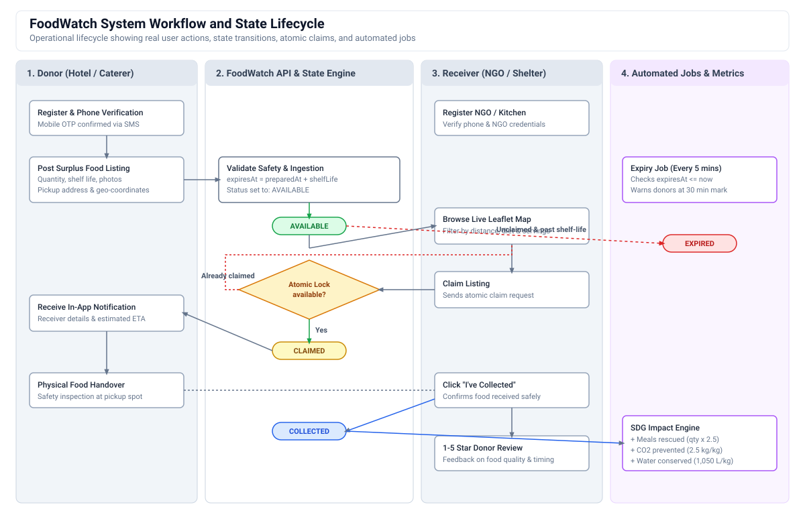
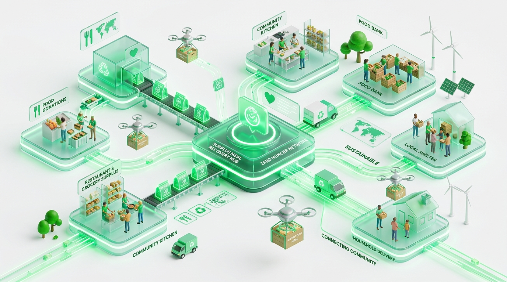

# FoodWatch

FoodWatch is a web platform built for the 1M1B (1 Million for 1 Billion) initiative to address food waste and hunger (UN SDG 2: Zero Hunger). It connects commercial and individual food donors—such as restaurants, wedding halls, hostels, and caterers—with local NGOs, orphanages, and community kitchens in real time.


---

## Why this project exists

Every night across Indian cities, large events and restaurants throw away trays of good, freshly cooked food simply because there is no quick way to coordinate a pickup. Meanwhile, shelters and community kitchens just a few kilometers away operate on tight budgets and struggle to supply daily meals.

FoodWatch bridges this gap. Donors can list surplus food with preparation time, expiry estimates, dietary tags, and pickup coordinates in under a minute. Verified recipients see listings on a live map, claim what they need, and complete the pickup before the food spoils.



---

## System Workflow



The diagram above illustrates the operational lifecycle and state transitions between donors, the platform engine, recipients, and background tasks.

```mermaid
flowchart TD
    subgraph Donor_Flow["Donor Workflow"]
        D1[Donor posts surplus food] --> D2[Specify quantity, photos, shelf-life and pickup window]
        D2 --> D3[Accept food hygiene declaration]
    end

    subgraph Core_Engine["Platform Engine and State Lifecycle"]
        D3 --> S1[Calculate expiresAt = preparedAt + shelfLife]
        S1 --> S2["Status: AVAILABLE"]
        
        S2 --> S3{"Atomic Claim Attempt<br/>(findOneAndUpdate status == available)"}
        S3 -->|Conflict / Already Claimed| R_Err[Return 409 error to second claimant]
        S3 -->|Lock Acquired| S4["Status: CLAIMED<br/>Lock listing and notify donor"]
        
        S4 --> S5{"Pickup Handover"}
        S5 -->|Receiver Cancels| S2
        S5 -->|Receiver Confirms Pickup| S6["Status: COLLECTED"]
    end

    subgraph Receiver_Flow["Receiver / NGO Workflow"]
        R1[Discover food on live Leaflet map] --> R2[Filter by distance and dietary tags]
        R2 --> S3
        S4 --> R3[Get donor contact details and pickup window]
        R3 --> R4[Arrive at location and inspect food]
        R4 -->|Click "I've Collected"| S5
        S6 --> R5[Submit 1-5 star donor rating and review]
    end

    subgraph Automated_Jobs["Background Jobs & Metrics"]
        Cron[Cron runs every 5 minutes] -->|expiresAt within 30 mins| Warn[Send expiry warning to donor]
        Cron -->|now >= expiresAt and unclaimed| S_Exp["Status: EXPIRED<br/>Remove from public map"]
        S6 --> Impact[Recalculate meals rescued, CO2 avoided and water saved]
    end
```



---

## Features

- **Fast listing creation**: Add item details, dietary tags (Veg, Non-Veg, Vegan), allergen info, storage condition, and photos.
- **Expiry timers**: Automated countdown based on preparation time and shelf life, warning donors when food is near expiry.
- **Interactive map**: Leaflet and OpenStreetMap integration to view nearby donations by distance.
- **Race-condition safe claims**: Listings lock immediately upon being claimed so two organizations cannot claim the same food.
- **Phone OTP verification**: Both donors and receivers verify their phone number to keep accounts accountable.
- **Collection tracking and reviews**: Receivers mark items as collected and leave a 1 to 5 star rating for the donor.
- **Impact tracker**: Live counters for estimated meals saved, kilograms rescued, and water/carbon footprint diverted.
- **Research and policy hub**: A collection of static reference pages covering post-harvest data from ICAR/FAO and relevant government programs (PMKSY, RKVY).
- **Presentation Deck**: Includes an executive 12-slide presentation ([`FoodWatch_Project_Presentation.pptx`](file:///c:/Users/pranjal/OneDrive/Documents/project/FoodWatch_Project_Presentation.pptx)) and an interactive web slide deck ([`presentation.html`](file:///c:/Users/pranjal/OneDrive/Documents/project/presentation.html)) with speaker notes for 1M1B reviews and project evaluations.

---

## Tech Stack

- **Frontend**: React 18, React Router v6, Leaflet / OpenStreetMap, Recharts, Vanilla CSS
- **Backend**: Node.js, Express.js
- **Database**: MongoDB with Mongoose
- **Auth & Security**: JWT, bcrypt, SMS OTP (MSG91 / Twilio / local console fallback)
- **Background Tasks**: node-cron for automated expiry checks every 5 minutes

---

## Repository Structure

```
project/
├── index.html              # Static research and policy pages
├── problem.html
├── solutions.html
├── government.html
├── data.html
├── bob.html
├── css/                    # Static site styling
├── js/                     # Static site scripts
└── platform/               # Full-stack application
    ├── package.json        # Concurrent dev script runner
    ├── server/             # Express API and MongoDB models
    │   ├── src/
    │   │   ├── models/     # User, Donation, Claim, Rating, Notification
    │   │   ├── routes/     # Auth, Donations, Claims, Ratings, Impact
    │   │   └── jobs/       # Expiry background cron
    │   └── uploads/        # Uploaded donation images
    └── client/             # React application
        ├── public/         # Static assets and images
        └── src/
            ├── components/ # Reusable UI, cards, auth forms, navbar
            └── pages/      # Home, Browse, Donor, Receiver, Admin, Impact
```

---

## Setup and Installation

### Prerequisites
- Node.js (v18 or higher)
- MongoDB (running locally or a MongoDB Atlas URI)

### ⚡ Quick Start (Windows)
Simply double-click `start_platform.bat` (or run `.\start_platform.bat` in your terminal). It will automatically:
- Set up local `.env` files from `.env.example`
- Install all necessary dependencies for server and client
- Launch both the client (`http://localhost:3000`) and API server (`http://localhost:5000`) concurrently.

---

### 💻 Manual Setup & Run

#### 1. Clone the repository
```bash
git clone https://github.com/zeaqc/FoodWatch-1m1b.git
cd FoodWatch-1m1b
```

#### 2. Install all dependencies
```bash
npm run install:all
```
*(Installs dependencies for the root runner, the server, and the client).*

#### 3. Configure environment variables
Copy the template files for both backend and frontend:
```bash
# Windows PowerShell:
Copy-Item platform\server\.env.example platform\server\.env
Copy-Item platform\client\.env.example platform\client\.env

# macOS / Linux:
cp platform/server/.env.example platform/server/.env
cp platform/client/.env.example platform/client/.env
```

Ensure your MongoDB instance is running (local MongoDB on port 27017, or set `MONGO_URI` to a MongoDB Atlas cluster URI in `platform/server/.env`).

#### 4. Run the development server
From the repository root:
```bash
npm start
```
- Frontend client runs at `http://localhost:3000`
- Backend API runs at `http://localhost:5000`

---

### 📽️ Static Research & Presentation Deck
To view the static policy research hub or the interactive slide presentation:
- **Presentation Deck**: Open `presentation.html` in your browser or download [`FoodWatch_Project_Presentation.pptx`](FoodWatch_Project_Presentation.pptx).
- **Policy Hub**: Open `index.html`, `problem.html`, `solutions.html`, or `government.html`.

### 4. Create an admin user (optional)
To access the admin dashboard, create an admin entry directly in your MongoDB database:
```bash
# In platform/server, generate a password hash:
node -e "require('bcryptjs').hash('Admin@123', 12).then(console.log)"
```
Insert into your MongoDB `users` collection:
```javascript
use foodwatch;
db.users.insertOne({
  role: "admin",
  name: "Admin",
  email: "admin@foodwatch.in",
  phone: "9999999999",
  passwordHash: "<PASTE_GENERATED_HASH>",
  isVerified: true,
  isActive: true,
  phoneVerified: true,
  createdAt: new Date(),
  updatedAt: new Date()
});
```

---

## Safety and Privacy Notes

- **Food safety declaration**: Donors must confirm they followed standard hygiene and handling practices before submitting a listing.
- **Privacy (DPDP Act compliance)**: Full 12-digit national ID numbers are never collected or stored. Only optional last 4 digits are used with explicit consent.
- **Accountability**: Phone verification is required before any listing can be posted or claimed.

---

## License

MIT License. Developed for the 1M1B Zero Hunger initiative.
